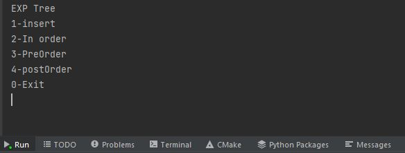
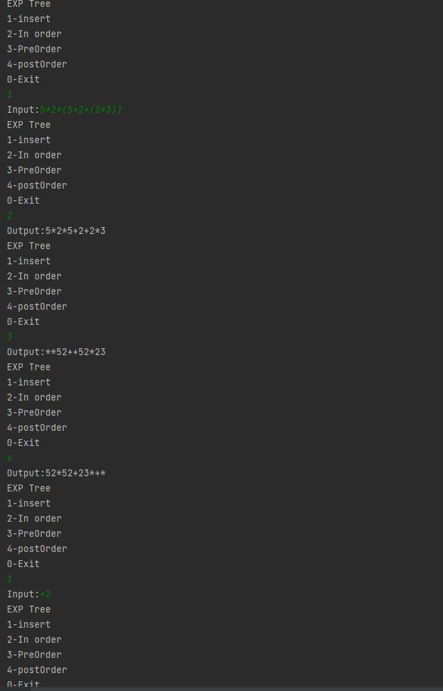

# expression-evaluation-tree
- c++ expression evaluation tree for evaluation mathematical operators considering the priority for each operator and for brackets also for (learning purpose)
- input consists of digits (not numbers) and operators only (*,/,+,-) and brackets ()

1. insert
    - used to insert expression which consists of digits and operators and brackets example 1+2*9+(2*(1+3))
    - numbers aren't allowed ex 33*22 only digits 3*2
    - you can insert to the tree more than one time it will be ordered by operators and brackets from left to right
  
2. in order
    - used to print the tree data in order of insertion (inorder tree traversal)
3. preorder
    - used to print the tree data in pre order (preorder tree traversal) -> operator operand1 operand2
4. post order
    - used to print the tree data in post order (postorder tree traversal) -> operand1 operand2 operator

